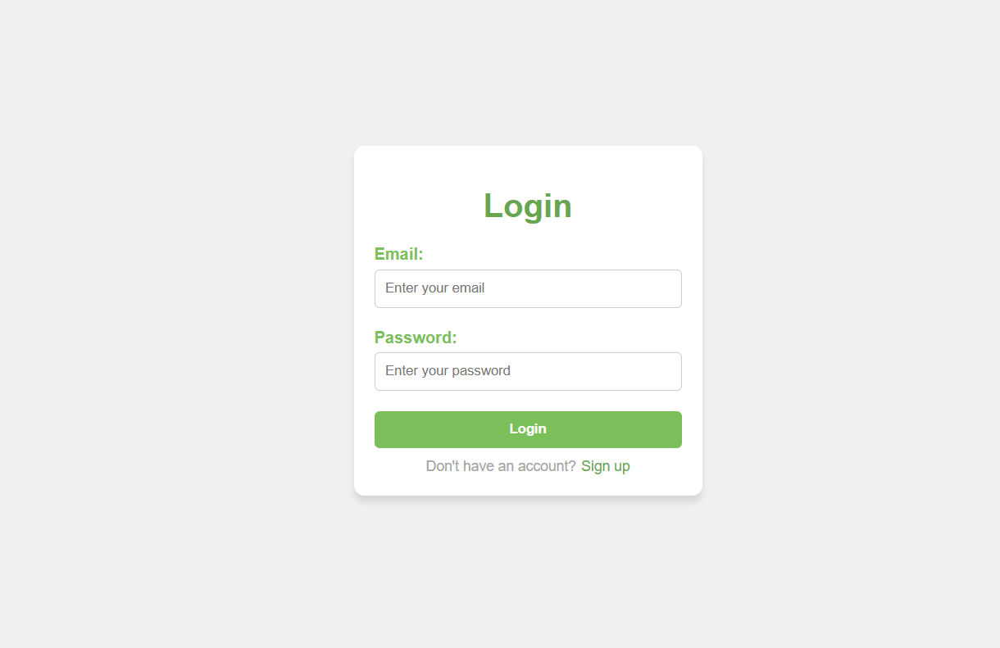
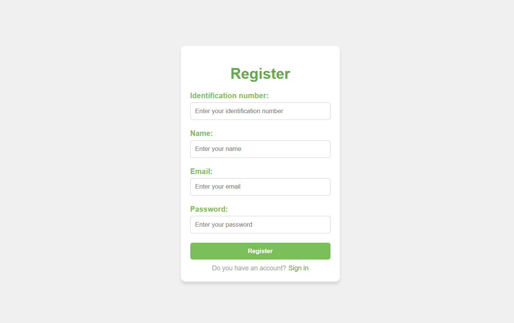

# Frontend Node.js Project Documentation

Este proyecto es un sistema de frontend que utiliza Node.js como entorno para correr la aplicación. Se comunica con un backend previamente desarrollado en Java, que corre en el puerto `8080`. La aplicación ofrece módulos para login, registro y un dashboard dinámico que muestra información del usuario autenticado.

## Descripción
- **Tecnología principal:** Node.js
- **Motor de plantillas:** `.ejs`
- **Backend asociado:** Java Spring Boot (corriendo en el puerto `8080`)
- **Puerto del frontend:** `3500`
- **Módulos incluidos:** Login, Register, Dashboard

La aplicación permite a los usuarios:
1. Iniciar sesión con su correo electrónico y contraseña.
2. Registrarse proporcionando información como número de identificación, nombre, correo electrónico y contraseña.
3. Acceder a un dashboard que muestra información dinámica del usuario autenticado.

Adicionalmente, se manejan errores mediante alertas en función de las respuestas recibidas del backend.

---

## Estructura del proyecto
La estructura de carpetas del proyecto es la siguiente:

```
LOGIN-HTML/
├── assets/                         # Archivos estáticos como imágenes, íconos, etc.
├── node_modules/                   # Dependencias instaladas de Node.js
├── public/                         # Archivos de la primera clase
├── src/                            # Código fuente principal
│   ├── controllers/                # Controladores que manejan la lógica de la aplicación
│   │   └── authController.js
│   ├── models/                     # Modelos de datos para manejar las entidades de la aplicación
│   │   ├── LoginUser.js
│   │   └── RegisterUser.js
│   ├── routes/                     # Definición de rutas principales de la aplicación
│   │   └── mainRoutes.js
│   ├── views/                      # Vistas .ejs organizadas por módulo
│       ├── dashboard/              # Archivos relacionados con el módulo del dashboard
│       │   ├── dashboard.css
│       │   ├── dashboard.ejs
│       │   └── dashboard.js
│       ├── login/                  # Archivos relacionados con el módulo de login
│       │   ├── login.css
│       │   ├── login.ejs
│       │   └── login.js
│       └── register/               # Archivos relacionados con el módulo de registro
│           ├── register.css
│           ├── register.ejs
│           └── register.js
├── .env                            # Variables de entorno para configuración
├── .gitignore                      # Archivos y carpetas ignorados por Git
├── app.js                          # Punto de entrada de la aplicación
├── package-lock.json               # Información de las versiones exactas de las dependencias
├── package.json                    # Archivo de configuración del proyecto
└── README.md                       # Documentación del proyecto
```

---

## Detalles de los módulos

### Login
- **Vista:** `login.ejs`
- **Requisitos:**
  - Email
  - Contraseña
- **Descripción:** Permite a los usuarios autenticarse en el sistema enviando las credenciales al backend.

### Register
- **Vista:** `register.ejs`
- **Requisitos:**
  - Número de identificación
  - Nombre
  - Email
  - Contraseña
- **Descripción:** Permite a nuevos usuarios registrarse en el sistema. La información se envía al backend para ser almacenada.

### Dashboard
- **Vista:** `dashboard.ejs`
- **Descripción:** Muestra información dinámica sobre el usuario que inició sesión. Los datos se obtienen del backend.

---

## Configuración
### Instalación
1. Clona este repositorio:
   ```bash
   git clone https://github.com/StevenAngelSofka/Login-html
2. Instala las dependencias:
   ```bash
   npm install
   ```

3. Crea un archivo `.env` basado en el archivo de ejemplo y configura las variables necesarias, como el puerto del servidor (`PORT=3500`).

4. Inicia el servidor:
   ```bash
   npm run start
   ```

---

## Imágenes de los módulos
A continuación, se presentan capturas de pantalla de cada módulo:

### Login


### Register


### Dashboard


---

## Notas adicionales
- **Backend:** El backend desarrollado en Java maneja todas las operaciones relacionadas con la autenticación, el registro y la gestión de datos del usuario.
- **EJS:** Las vistas están diseñadas con `.ejs` para permitir la renderización dinámica de contenido en el servidor.
- **Modelos:**
  - `LoginUser.js`: Modela los datos requeridos para el inicio de sesión.
  - `RegisterUser.js`: Modela los datos necesarios para el registro de un nuevo usuario.
- **Manejo de errores:** Se muestran alertas al usuario según las respuestas del backend, como errores de validación o problemas de autenticación.
- **Local Storage:** Se usa el local storage para guardar el token obtenido desde el backend para usarlo cuando sea necesario.

---


