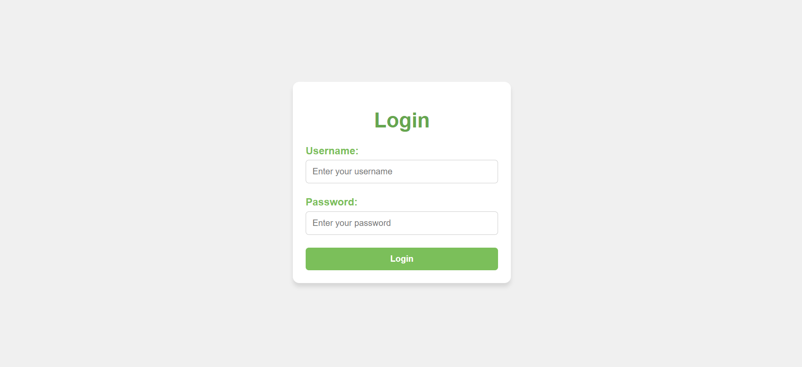
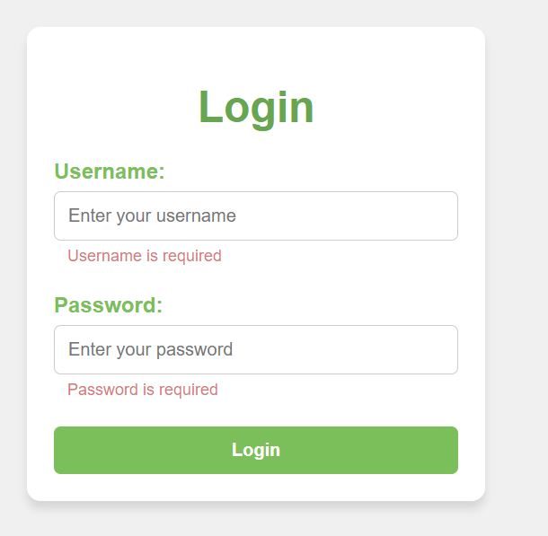
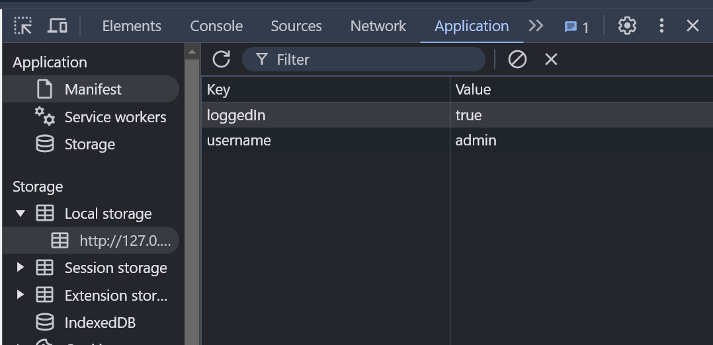

# Login App

Esta es una simple aplicación de login construida con HTML, CSS y JavaScript. Permite al usuario ingresar sus credenciales, validarlas, y redirigirlo o mostrar mensajes de éxito o error según el caso. La aplicación también utiliza el almacenamiento local (localStorage) para guardar la información del usuario al momento de un inicio de sesión exitoso.

## Características

- Formulario de login con campos de **username** y **password**.
- Validación de los campos para evitar que se envíen vacíos.
- Mensajes de error que se muestran debajo de cada campo si están vacíos.
- Almacenamiento de las credenciales en el `localStorage` tras un login exitoso.
- Alerta de confirmación del LOGIN correcto.

## Credenciales de Prueba

Para probar el login, utiliza las siguientes credenciales:

- **Username**: `admin`
- **Password**: `admin1234`

### **Pasos para probar la aplicación:**
1. Abre el archivo `index.html` en tu navegador.
2. Ingresa el **Username** y **Password** mencionados arriba en los campos correspondientes.
3. Haz clic en el botón **Login**.
4. Si las credenciales son correctas, verás un mensaje de alerta que indica "Login successful! Please check LocalStorage." y los datos se almacenarán en el `localStorage`.
5. Si las credenciales son incorrectas, verás un mensaje de error que indica que las credenciales son incorrectas.

## Imágenes

### 1. Interfaz de la aplicación
Esta es la vista de cómo se muestra la aplicación de login:



### 2. Mensajes de error
Así se muestran los mensajes de error si algún campo de entrada está vacío:



### 3. Contenido del `localStorage`
Cuando el login es exitoso, los datos se guardan en el `localStorage` del navegador. A continuación se muestra cómo se ve el contenido de `localStorage` después de un login exitoso:



## Instrucciones de instalación

Para probar la aplicación en tu máquina local:

1. Clona este repositorio:

   ```bash
   git clone https://github.com/StevenAngelSofka/Login-html.git